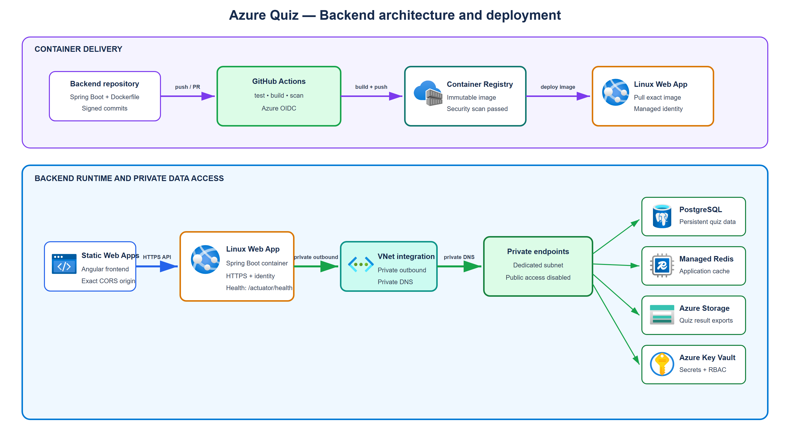

# azure-quiz-backend

Spring Boot REST API for the Microsoft Azure certifications revision app (AZ-900 to start, other certifications
like AZ-104 can be added later with no schema change — see "Data model" below).


## Stack

- Java 21, Spring Boot 3.5.x, Maven
- Spring Web, Spring Data JPA, PostgreSQL, Flyway, Bean Validation, Lombok, Actuator
- Spring Data Redis (cache - see "Running locally" below)
- Spring Cloud Azure Storage Blob (quiz result export - see "Running locally" below)
- springdoc-openapi (Swagger UI)
- Tests: JUnit 5, Mockito, AssertJ

## Application architecture

The backend is the only component allowed to communicate with the data
services. The Angular frontend calls its REST API over HTTPS and never connects
directly to PostgreSQL, Redis, Storage or Key Vault.



The editable draw.io source is available at
[`docs/application-architecture.drawio`](docs/application-architecture.drawio).

Main runtime flow:

```text
Angular frontend (Azure Static Web Apps)
                  |
                  | HTTPS REST API
                  v
Spring Boot backend (Azure Linux Web App)
                  |
                  +--> PostgreSQL Flexible Server: persistent quiz data
                  +--> Azure Managed Redis: application cache
                  +--> Azure Storage: exported quiz results
                  +--> Azure Key Vault: secrets and sensitive configuration
```

In Azure, the Web App uses VNet integration to reach data services through
private endpoints and private DNS. Public access to those data services is
disabled. The Web App uses a managed identity for Azure resource access.

The complete infrastructure and its decisions are maintained in the
`bilan-azure-terraform` repository.

## Running locally

Prerequisites: JDK 21, Docker (Desktop or Engine) running.

```bash
./mvnw spring-boot:run    # starts the API on http://localhost:8080
```

That's it — a plain `./mvnw spring-boot:run`, or hitting "Run" on `AzureQuizBackendApplication` in
your IDE, is enough on its own. The `spring-boot-docker-compose` dependency (pom.xml) detects
`docker-compose.yml` at the project root and automatically starts Postgres + Redis + Azurite (a
local Azure Blob Storage emulator) for you before the app context loads, then stops them when the
app stops — no manual `docker compose up -d` step. It's marked `optional`, so it never ships in the
production jar deployed to Azure App Service; this convenience is dev-only.

If you'd rather manage the containers yourself (e.g. keep them running across multiple app restarts
instead of stopping them every time), that still works exactly as before:

```bash
docker compose up -d      # starts Postgres + Redis + Azurite (see docker-compose.yml)
./mvnw spring-boot:run
```

Flyway applies the migrations (`src/main/resources/db/migration`) on startup, including the real content for
AZ-900 modules 1 to 6 (`V2` to `V7`, 45 questions per module: 30 standard questions + 15 scenario questions).
The 30 standard questions per module come from the trainer's answer key; the 15 scenario questions have no
written answer key (the trainer corrects them live) — their answers were determined from AZ-900 fundamentals
and deserve a quick review before use in training. One inconsistency was found and fixed in the trainer's
answer key: Module 1 Q8 marked "SaaS" as the answer while the explanation clearly describes PaaS — the
objectively correct answer (PaaS) was imported.

Six official mock exams (`V9` to `V14`, AZ900_Test_A to F, 50 questions each with answers/explanations
included in the same source document) are imported as modules of type `MOCK_EXAM` (`type` column on
`module`, migration `V8`). They stay strictly independent from each other and from course modules: the
random exam mode (`EXAM`) only draws from modules of type `CONTENT` (see
`QuestionRepository.findRandomActiveByCertification`).

`docker-compose up -d` also starts a local Redis (no auth, plaintext) backing
`CertificationService.getAllCertifications()` and `ModuleService.getModulesByCertification()`, both
`@Cacheable` (see `CacheConfig` for why values are JSON-serialized rather than the JDK-serialization
default). Entries expire after 30 minutes; there's no explicit eviction on writes, since the underlying
data (certifications/modules) only ever changes via a new Flyway migration, not through the running app.

Every call to `GET /api/quiz-sessions/{sessionId}/result` also exports that result as a JSON blob
(`QuizResultExportService`), downloadable again through `GET /api/quiz-sessions/{sessionId}/result/export`
— the simplest concrete use of the Storage Account provisioned for this TP. Locally this goes to Azurite;
in prod, to the `java-uploads-<owner>` container (Terraform's `storage-java.tf`), authenticated via this
Web App's managed identity, no account key involved either way (`shared_access_key_enabled = false` on
the account). A Storage outage never breaks the quiz itself — the export failing is only logged, not
thrown; Postgres stays the source of truth for results.

Swagger UI: http://localhost:8080/swagger-ui.html

## Tests

```bash
./mvnw test
```

## Planned continuous deployment

The backend delivery pipeline will be implemented with GitHub Actions. A change
to the backend must follow this sequence:

1. check out the signed commit;
2. install Java 21 and restore Maven dependencies;
3. run `./mvnw test`;
4. build the application and its immutable container image;
5. scan the source, dependencies, secrets and image;
6. authenticate to Azure with GitHub OIDC, without a permanent client secret;
7. push the image to Azure Container Registry;
8. deploy that exact image to the non-production Azure Linux Web App;
9. call `/actuator/health` and execute API smoke tests;
10. mark the workflow as failed so developers can see and diagnose any error.

Infrastructure is provisioned separately by Terraform. The application
pipeline deploys code but must not create or modify shared infrastructure.
Pre-production uses the same container and configuration model as production;
only environment-specific values and secrets differ.

This section documents the target workflow. The GitHub Actions workflow is not
considered operational until its file, OIDC identity, protected environment and
successful run have been added and verified.

## Environment variables (production)

The `default` profile (active locally) defines a localhost datasource in `application.yml`. In production,
set these environment variables (e.g. Azure App Service) — they directly override the corresponding Spring
properties, no extra profile needs activating:

| Variable | Description |
|---|---|
| `SPRING_DATASOURCE_URL` | PostgreSQL JDBC URL, e.g. `jdbc:postgresql://<host>:5432/azurequiz` |
| `SPRING_DATASOURCE_USERNAME` | PostgreSQL user |
| `SPRING_DATASOURCE_PASSWORD` | PostgreSQL password |
| `APP_CORS_ALLOWED_ORIGINS` | Allowed origin(s), e.g. the frontend Static Web App URL |
| `REDIS_HOSTNAME` | Redis host, e.g. Azure Managed Redis's hostname |
| `REDIS_PORT` | Redis port. Defaults to `6379` (docker-compose) locally; Azure Managed Redis exposes a different port, see the infra repo's `redis.tf` |
| `REDIS_PASSWORD` | Redis access key. Empty locally (docker-compose's Redis has no auth) |
| `REDIS_SSL_ENABLED` | `true` in prod (Azure Managed Redis requires TLS), `false` locally |
| `BACKEND_API_KEY` | Shared secret the frontend must send as `X-Api-Key` (see `ApiKeyFilter`). Left unset locally — the check is skipped. In prod it's injected from Key Vault (see `app-service-java.tf` / `keyvault.tf` in the infra repo). |
| `STORAGE_ACCOUNT_NAME` | Storage Account name. Authenticated via this Web App's managed identity (no key) — see `SPRING_PROFILES_ACTIVE` below for why |
| `STORAGE_CONTAINER_NAME` | Blob container for quiz result exports, e.g. `java-uploads-<owner>` |
| `SPRING_PROFILES_ACTIVE` | Set to `prod` by Terraform. Deactivates the `default` profile's local-only settings (localhost datasource, Azurite connection string) — without it, Blob Storage would try to reach a local Azurite that doesn't exist in Azure |

## Data model

`certification` (e.g. AZ-900, AZ-104...) → `module` → `question` → `answer_option`. A quiz session
(`quiz_session`) is tied to a certification and, in review mode, to a specific module; in exam mode,
questions are drawn randomly from all active modules of the chosen certification.

Adding a new certification requires no schema migration: just insert a row into `certification` and its
associated modules/questions (a dedicated Flyway migration, generated from the supplied content).

## API contract

- `GET /api/certifications` — list of available certifications
- `GET /api/certifications/{certificationId}/modules` — modules of a certification, with active question count and `type` (`CONTENT` or `MOCK_EXAM`)
- `POST /api/quiz-sessions` — creates a session
  - `MODULE` mode: `{ "mode": "MODULE", "moduleId": "..." , "questionCount": 10 }` (`questionCount` optional, otherwise all active questions in the module)
  - `EXAM` mode: `{ "mode": "EXAM", "certificationId": "...", "questionCount": 40 }` (`questionCount` optional, default 40)
  - the response contains the questions and their options **without** indicating the correct answer
- `POST /api/quiz-sessions/{sessionId}/questions/{questionId}/answer` — submits an answer, returns whether it's correct + the correct options + the explanation
- `GET /api/quiz-sessions/{sessionId}/result` — final aggregated score for the session; also exports it as a JSON blob (see "Running locally")
- `GET /api/quiz-sessions/{sessionId}/result/export` — downloads that exported blob (404 if `result` was never called for this session)


## Out of scope for this repo

- Provisioning Azure infrastructure (App Service, Static Web App, PostgreSQL Flexible Server)
- Importing the real question content (supplied separately, converted into Flyway migrations).
